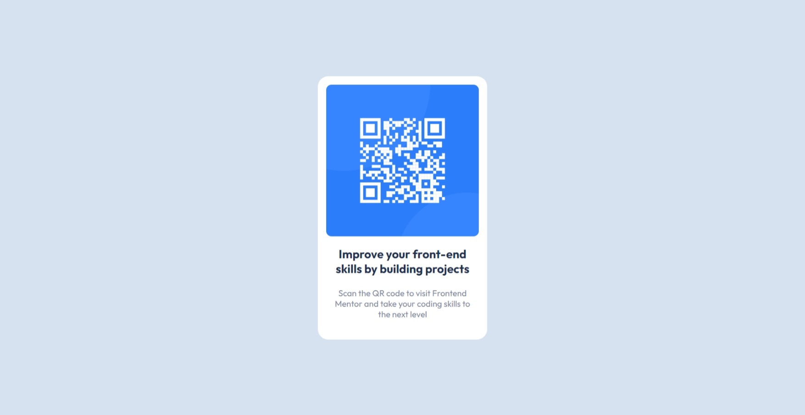

# Frontend Mentor - QR code component solution

This is a solution to the [QR code component challenge on Frontend Mentor](https://www.frontendmentor.io/challenges/qr-code-component-iux_sIO_H). Frontend Mentor challenges help you improve your coding skills by building realistic projects. 

## Table of contents

- [Overview](#overview)
  - [Screenshot](#screenshot)
  - [Links](#links)
- [My process](#my-process)
  - [Built with](#built-with)
- [Author](#author)
- [Acknowledgments](#acknowledgments)

## Overview

### Screenshot

#### Mobile Version

#### Desktop Version

### Links

- Solution URL: [Solution URL](https://www.frontendmentor.io/solutions/frontend-mentor-qr-code-component-ctAsQ2ScWy)
- Live Site URL: [Live Site](https://heychobe.github.io/frotend-metors-exercises/qr-code-component-main/index.html)

## My process

### Built with

- Semantic HTML5 markup
- CSS custom properties
- Flexbox
 
## Author

- Website - [Carlos Cortez](https://portfolio-heychobe.vercel.app/)
- Frontend Mentor - [@HeyChobe](https://www.frontendmentor.io/profile/HeyChobe)

## Acknowledgments
Was very funny create the Github Pages with them.

- [FR0K3](https://github.com/FR0K3)
- [HenryLima07](https://github.com/HenryLima07)
